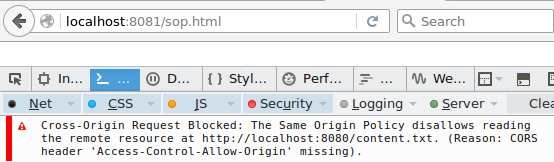
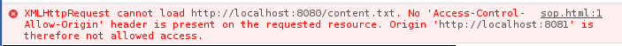
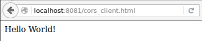
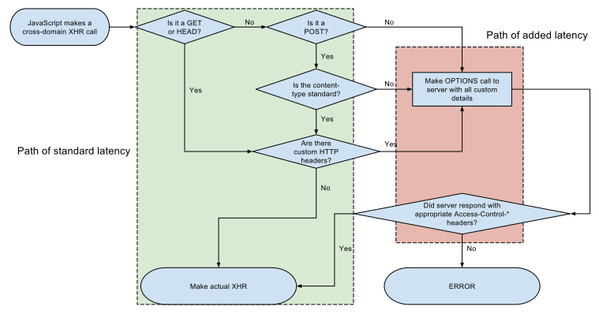

## Communication avec le serveur

La *Same Origin Policy*

    !html
    

    
    

Firefox :

Chrome :

---

## JSONP

Le chargement de script n'est pas soumis à la *Same Origin Policy*.

Le client définit une fonction :

    !js
    function foo(data) {
      // faire quelque chose avec data
    }

et charge un script depuis le serveur tiers :

    !html
    

Le script fourni par le serveur tiers appelle la fonction définie par le client :

    !js
    foo({toto: 42, baz: "quux"});

---

## JSONP

### Avantages

* supporte les vieux navigateurs
* simple
* supporté par jQuery

### Inconvénients

* bidouille
* lecture seule
* gestion d'erreur (voir [jquery-jsonp](https://github.com/jaubourg/jquery-jsonp) )

### Step by step tutorial

[How to build a web widget (using jQuery)](http://alexmarandon.com/articles/web_widget_jquery/)

---

## CORS

### Serveur

    !js
    var fs = require('fs'), http = require('http');

    http.createServer(function (req, res) {
      fs.readFile(__dirname + req.url, function (err,data) {
        res.setHeader('Access-Control-Allow-Origin', '*');
        res.writeHead(200);
        res.end(data);
      });
    }).listen(8080);

### Client

    !html
    

    
    

### Résultat

---

## CORS

### Avantages

* standard défini
* toutes les requêtes possibles, y compris en écriture
* permet le [chargement cross-domain de fonts](https://davidwalsh.name/cdn-fonts)

### Inconvénients

* pas supporté par les vieux navigateurs
* pas forcément trivial à mettre en place

---

## CORS

