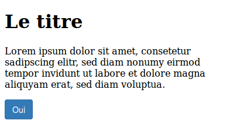

## Chargement de CSS

    !js
    function loadCss(url) {
      var link = $("<link>", {rel: "stylesheet", href: url});
      link.appendTo($(document));  
    }

### Inconvénients

* risque de **FOUC** (Flash Of Unstyled Content)
* pas de manière fiable de détecter quand la CSS a fini d'être chargée **et** appliquée. 

### Contournement possibles

* appliquer un style "rare" (une couleur) à un élément et faire du polling sur le document pour détecter quand ce style a été appliqué
* inclure les styles dans un élément `<style>` qui précède le HTML

---

## Précautions de codage CSS

* faire des règles spécifiques
* préfixer ses classes
* attention si on utilise des z-index

---

## Import de CSS tiers

### Exemple avec Bootstrap

    !scss
    .toulousejs-widget-container {
      // Import de bootstrap.css avec prefix
      @import (less) "src/lib/bootstrap/bootstrap.css";

      // Idem pour select2
      @import (less) "src/lib/select2/select2.css";
      @import (less) "src/lib/select2-bootstrap.css";
      @import "src/lib/bootstrap/variables.less";

      // Reste de nos styles
      .foo-bar {
        text-align: left;
      }
      // ...
    }

## Appliquer Bootstrap à une partie de la page

En utilisant un préprocesseur, il est également possible de **limiter l'impact de
Bootstrap à une partie de la page**. Cela peut-être utile si on crée un composant
ou un widget ayant vocation à être utilisé dans des pages qui n'utilisent pas
Bootstrap.

Considérons ce code HTML :

    <!doctype html>
    <html>
        <head>
            <meta charset="utf-8">
            <meta http-equiv="X-UA-Compatible" content="IE=edge,chrome=1">
            <link rel="stylesheet" href="css/bootstrap.css">
        </head>
        <body>

          

            <h1>Le titre</h1>
            

            Lorem ipsum dolor sit amet, consetetur sadipscing elitr, sed diam nonumy eirmod
            tempor invidunt ut labore et dolore magna aliquyam erat, sed diam voluptua. 

            <button class="btn btn-primary">Bouton bootstrap</button>
          

        </body>
    </html>

Ce code va donner le résultat suivant :

.. image:: bootstrap-preprocesseur-images/application-globale-de-bootstrap/image

On voit que les styles par défaut de Bootstrap sont appliqués aussi bien au
texte du paragraphe qu'au bouton. Imaginons à présent que nous souhaitions
**appliquer Bootstrap uniquement au bouton** et conserver le texte dans le style
par défaut du navigateur. On emballe le bouton dans un ``div`` avec un attribut
``class`` de notre choix qui va délimiter la portée de notre composant :

.. code:: html

    <!doctype html>
    <html>
        <head>
            <meta charset="utf-8">
            <meta http-equiv="X-UA-Compatible" content="IE=edge,chrome=1">
            <link rel="stylesheet" href="css/button.css">
        </head>
        <body>

          

            <h1>Le titre</h1>
            

            Lorem ipsum dolor sit amet, consetetur sadipscing elitr, sed diam nonumy eirmod
            tempor invidunt ut labore et dolore magna aliquyam erat, sed diam voluptua. 

            

              <button class="btn btn-primary">Bouton bootstrap</button>
            

          

        </body>
    </html>

Pour que Bootstrap ne s'applique qu'au contenu de ``.my-fabulous-widget``, on crée un fichier Sass comme celui-ci :

.. code:: scss

    .my-fabulous-widget {
        @import "bootstrap";

        // Reprise des styles définis pour "html" et "body" dans
        // dans _normalize.scss

        // Auparavant dans "html {"
        // font-family: sans-serif; // Surchargé plus bas
        -ms-text-size-adjust: 100%;
        -webkit-text-size-adjust: 100%;

        // Auparavant dans "body {"
        margin: 0;

        // Reprise des styles définis pour "html" et "body" dans
        // _scaffolding.scss

        // Auparavant dans "html {"
        // font-size: 10px; // Surchargé plus bas
        -webkit-tap-highlight-color: rgba(0,0,0,0);

        // Auparavant dans "body {"
        font-family: $font-family-base;
        font-size: $font-size-base;
        line-height: $line-height-base;
        color: $text-color;
        background-color: $body-bg;
    }

Dans le CSS généré à partir de ce code, tous les styles de Bootstrap se
retrouvent précédés du sélecteur de classe ``.my-fabulous-widget``. On est
simplement obligés de reprendre à la main quelques propriétés que Bootstrap
applique aux éléments ``html`` et ``body`` afin les appliquer à la classe de
notre composant. On constate alors que les styles de Bootstrap s'appliquent
uniquement au contenu du ``div`` ciblé. Le texte se voit appliquer le style par
défaut du navigateur :

Plus d'info :

* [How to namespace Twitter Bootstrap so styles don't conflict](http://stackoverflow.com/a/13977230)
* [Customizing Bootstrap with a build process](http://www.nikhildabas.com/blog/2013/07/customizing-bootstrap-with-a-build-process)

