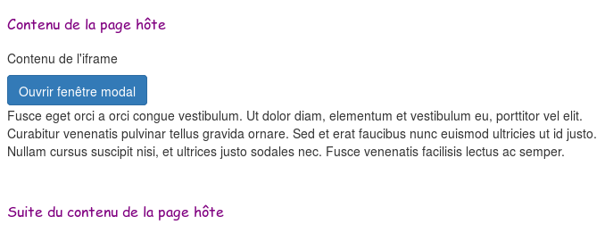
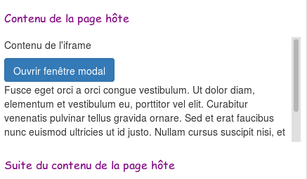
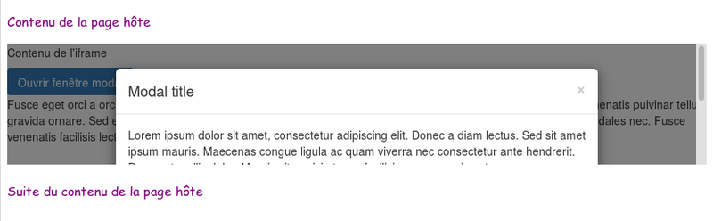
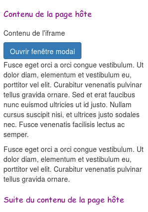
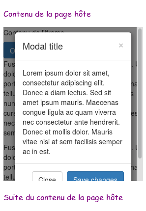

# iframes

```html
<!doctype html><meta charset="utf-8">
<style>
  body { font-family: "Comic Sans MS"; color: purple; }
  iframe { width: 100%; }
</style>
<p>Contenu de la page hôte</p>
<iframe src="iframe_content.html"></iframe>
<p>Suite du contenu de la page hôte</p>
```



## Premier problème : la hauteur de l'iframe ne s'adapte pas au contenu.



## Second problème : le contenu ne peut pas sortir du cadre.



Pose problème pour :

* fenêtres popup
* tooltips

## iframe avec Pym.js

Dans la page hôte :

```html
<p>Contenu de la page hôte</p>
<div id="iframe-wrapper"></div>
<p>Suite du contenu de la page hôte</p>
<script src="pym.js"></script>
<script>
    new pym.Parent('iframe-wrapper', 'iframe_content', {});
</script>
```

Dans la page invitée :

```
<script src="pym.js"></script>
<script>
    new pym.Child();
</script>
```

## iframe avec Pym.js

Le problème de hauteur de l'iframe est résolu.



Mais on ne peut toujours pas sortir de l'iframe.



## iframe

### Avantages

* isolation parfaite

### Inconvénients

* isolation parfaite
* problèmes d'adaptation à la taille contenu, voir [Pym.js](http://blog.apps.npr.org/pym.js/) \(merci [@mab\_](https://twitter.com/mab_)\)
* enfermé dans un cadre, problème par ex. avec tooltips
* performance


## Injection HTML

### Avantage

* s'intègre dans la page
* performance

### Inconvénients

* risques d'interactions indésirables avec la page \(JavaScript et CSS\)


